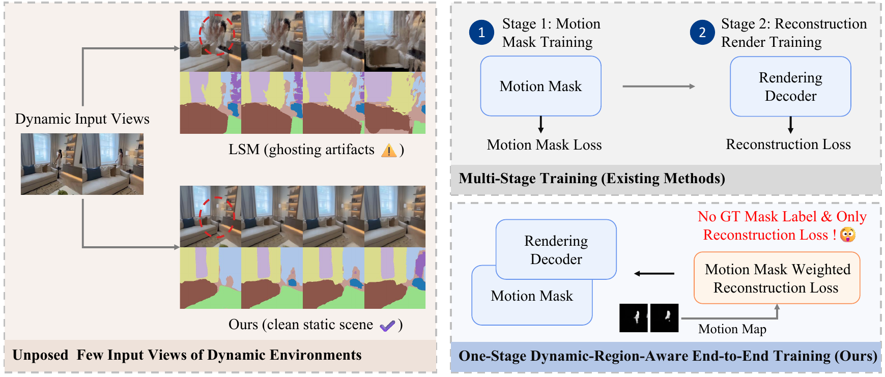
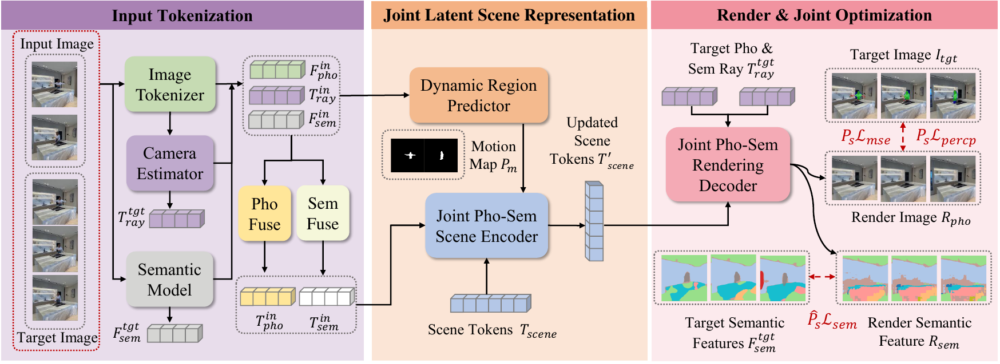
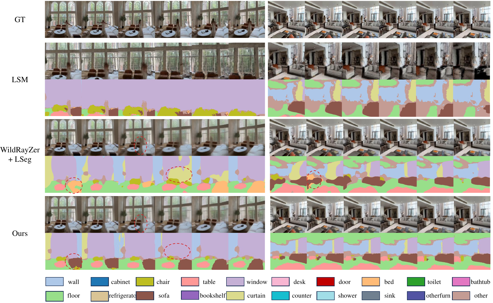
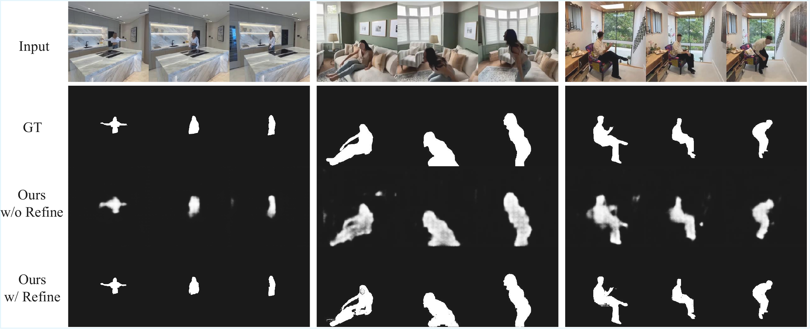

<div align="center">

# Dynamic-Robust Photometric-Semantic Reconstruction for Open-Vocabulary 3D Scene Understanding

Boyu Cai<sup>1,2</sup>, Li Yang<sup>2*</sup>, Yan Xu<sup>3</sup>, Wei Liu<sup>2</sup>, Nian Liu<sup>2</sup>, Sikui Zhang<sup>2</sup>, Yan Wang<sup>4</sup>, Chunfeng Yuan<sup>2</sup>, Weiming Hu<sup>1,2</sup>

<sup>1</sup>ShanghaiTech University &nbsp; <sup>2</sup>Institute of Automation, Chinese Academy of Sciences (CASIA)<br>
<sup>3</sup>The Chinese University of Hong Kong &nbsp; <sup>4</sup>Deepeleph Intelligent Technology

**ECCV 2026**

[[Project Page](https://dmucby.github.io/SPAR/)] [[Paper](https://arxiv.org/abs/2608.29177)] [[Code](https://github.com/dmucby/SPAR)]

<sup>*</sup>Corresponding author

</div>

---

## News

- **2026-09**: Initial SPAR code release.
- **2026-08**: The paper was released on [arXiv](https://arxiv.org/abs/2608.29177).
- **2026.06**: SPAR was accepted to ECCV 2026.

---

## Overview

The integration of novel view synthesis (NVS) and open-vocabulary segmentation (OVS) has recently yielded powerful feed-forward 3D foundation models. However, their inherent reliance on static-scene assumptions leads to severe misalignment of spatial features in unconstrained dynamic environments. To bridge this critical gap, we propose SPAR, a novel joint semantic-geometric encoding architecture that explicitly isolates transient dynamic noise prior to latent space aggregation. Furthermore, we introduce a dynamic-region-aware end-to-end training paradigm that structurally couples motion estimation with multi-view visual and semantic learning. This unified approach enables the network to inherently resolve motion conflicts and distill multi-view consistent, temporally stable scene representations from dynamic inputs.

Extensive experiments on the challenging D-RE10K benchmark demonstrate that SPAR achieves state-of-the-art performance. Our end-to-end approach achieves exceptional novel view synthesis quality, yielding a PSNR of 22.15 dB and 23.33 dB given only 3 and 4 input views respectively. Despite being trained in a self-supervised manner, our model achieves an mIoU of 88.5% for motion mask prediction. Furthermore, our analysis reveals a strong inter-task synergy between photometric scene reconstruction and semantic understanding, where semantic synthesis learning consistently enhances photometric fidelity in novel view rendering.

> **Release note:** the current public evaluator uses raw CV-DRP masks and does not run optional SAM2 refinement. Refer to the paper for the complete motion-mask evaluation protocol.



SPAR takes a few unposed views of a dynamic environment and renders clean target-view RGB images and open-vocabulary semantic predictions in one feed-forward pass.

---

## 1. Preparation

### Environment

The reference environment uses Python 3.10, CUDA 12.1, and PyTorch 2.4.1.

```bash
git clone --recurse-submodules https://github.com/dmucby/SPAR.git
cd SPAR

conda create -n spar python=3.10
conda activate spar
python -m pip install --upgrade pip
python -m pip install -r requirements.txt
```

If the repository was cloned without submodules:

```bash
git submodule update --init --recursive
```

### Data

The code has been tested with the following local data layout. These paths match `configs/spar/spar.yaml`:

```text
datasets/
├── Dynamic-RE10K/
│   ├── train_official/
│   │   ├── full_list.txt
│   │   ├── metadata/
│   │   └── images/
│   └── test_zip/
│       ├── metadata/
│       ├── images/
│       ├── binary_masks/
│       ├── pseudo_labelmaps/
│       └── videos/
└── re10k-full_processed/
    └── train/
        ├── full_list.txt
        ├── metadata/
        └── images/
```

Human-verified D-RE10K masks are used only for evaluation. SPAR does not require ground-truth motion masks for training. COCO assets used by the optional copy-paste training branch are not part of the tested local tree above; set `training.copy_paste.coco_annotation_path` and `training.copy_paste.coco_image_dir` before enabling that branch. The paper additionally reports semantic evaluation on ScanNet; that separate evaluation path is outside this minimal release.

### Checkpoints

Place the final SPAR checkpoint and external backbones at the following paths:

| Asset | Default path |
|---|---|
| Final SPAR checkpoint | `checkpoints/spar.pt` |
| DINOv3 ViT-B/16 | `datasets/pretrained/dinov3_vitb16_pretrain_lvd1689m-73cec8be.pth` |
| LSeg | `datasets/checkpoints/lseg/demo_e200.ckpt` |
| Reconstruction/CV-DRP initialization | `checkpoints/spar_reconstruction_init.pt` |
| VGG perceptual weights | `metric_checkpoint/imagenet-vgg-verydeep-19.mat` |

The final checkpoint is 7,471,393,494 bytes (approximately 7.0 GiB) and is intended to be distributed through Hugging Face rather than Git. DINOv3 and LSeg assets remain subject to their original licenses.

---

## 2. Method



SPAR is a Semantic-Photometric-Aware Reconstruction framework for joint novel-view synthesis and open-vocabulary semantic understanding from sparse, unposed, and dynamic views. Its main components are:

1. **Pose-conditioned tokenization**: image features, semantic features, and estimated Plucker rays are embedded into photometric and semantic tokens.
2. **Cross-View Dynamic Region Predictor (CV-DRP)**: cross-view semantic, appearance, and geometric cues identify transient foreground regions before scene aggregation.
3. **Joint photometric-semantic scene encoder**: predicted dynamic regions are suppressed while static multi-view evidence is aggregated into a compact scene representation.
4. **Dual-head rendering decoder**: target-view RGB images and semantic features are rendered from the shared scene representation.
5. **Dynamic-region-aware optimization**: predicted masks spatially weight photometric and semantic reconstruction losses, coupling CV-DRP and rendering in one end-to-end objective without manual motion labels.

---

## 3. Training

The paper setting uses 8 NVIDIA A800 GPUs, 20K end-to-end iterations, a learning rate of `2e-4`, cosine scheduling, `256 x 256` images, `16 x 16` patches, and 768 scene tokens.

```bash
CUDA_VISIBLE_DEVICES=0,1,2,3,4,5,6,7 \
NPROC_PER_NODE=8 \
bash train_spar.sh
```

The launcher reads `configs/spar/spar.yaml`. Paper reproduction initializes from `checkpoints/spar_reconstruction_init.pt`; training from scratch is available only as an explicit ablation with `training.allow_train_from_scratch=true`.

For online Weights & Biases logging, set `WANDB_MODE=online` and provide `WANDB_API_KEY`. Offline logging is used by default.

---

## 4. Inference

### Full 76-scene D-RE10K evaluation

The following command evaluates every scene found under `test_zip/metadata` with 2 input and 6 target views:

```bash
CUDA_VISIBLE_DEVICES=0 python test_spar.py \
  --single_gpu \
  --config configs/spar/spar.yaml \
  --checkpoint ./checkpoints/spar.pt \
  --test_root ./datasets/Dynamic-RE10K/test_zip \
  --num_input_views 2 \
  --fix_total_views 8 \
  --mask_source raw \
  --output_dir ./outputs/dre10k_raw_n2 \
  --no_save_vis \
  --no_eval_semantic
```

Results are written to `summary.json`, `per_scene_metrics.json`, and `summary.csv` in the output directory.

### Batch evaluation for 2, 3, and 4 input views

```bash
for num_views in 2 3 4; do
  CUDA_VISIBLE_DEVICES=0 python test_spar.py \
    --single_gpu \
    --config configs/spar/spar.yaml \
    --checkpoint ./checkpoints/spar.pt \
    --test_root ./datasets/Dynamic-RE10K/test_zip \
    --num_input_views "${num_views}" \
    --fix_total_views 8 \
    --mask_source raw \
    --output_dir "./outputs/dre10k_raw_n${num_views}" \
    --no_save_vis \
    --no_eval_semantic
done
```

The public evaluator uses raw CV-DRP masks. SAM2 refinement is disabled. `--mask_source gt` is retained only as an oracle diagnostic.

---

## 5. Results

### Dynamic novel-view synthesis on D-RE10K

| Input views | PSNR | SSIM | LPIPS |
|---:|---:|---:|---:|
| 2 | 19.97 | 0.627 | 0.339 |
| 3 | **22.15** | 0.702 | **0.283** |
| 4 | **23.33** | 0.739 | **0.263** |

### Qualitative results

<p align="center">
  
</p>

Qualitative comparison of novel-view synthesis and semantic segmentation on dynamic scenes, reproduced directly from the paper.

<p align="center">
  
</p>

Qualitative results of the Dynamic Region Predictor on diverse multi-view sequences, reproduced directly from the paper. The public evaluator corresponds to the **Ours w/o Refine** row and does not initialize SAM2.

### Joint rendering on ScanNet

| mIoU | Accuracy | PSNR | SSIM | LPIPS |
|---:|---:|---:|---:|---:|
| 0.5271 | **0.8061** | **26.43** | 0.8052 | 0.2407 |

See the [paper](https://arxiv.org/abs/2608.29177) for the complete comparisons, motion-mask evaluation, ablations, and qualitative results.

---

## 6. Known Issues

- Keep the total number of views consistent with training. For the released setup, use `--fix_total_views 8`.
- The current release evaluates raw CV-DRP masks and does not initialize SAM2 refinement.
- The bundled evaluator covers D-RE10K. Reproducing the paper's ScanNet semantic table requires the separate semantic evaluation path.

---

## Citation

If you find this work useful, please cite:

```bibtex
@inproceedings{cai2026spar,
  title     = {Dynamic-Robust Photometric-Semantic Reconstruction for
               Open-Vocabulary 3D Scene Understanding},
  author    = {Cai, Boyu and Yang, Li and Xu, Yan and Liu, Wei and Liu, Nian
               and Zhang, Sikui and Wang, Yan and Yuan, Chunfeng and Hu, Weiming},
  booktitle = {European Conference on Computer Vision (ECCV)},
  year      = {2026}
}
```

## License

The project code is released under [CC BY-NC-SA 4.0](LICENSE.md). Third-party components retain their original licenses; see [THIRD_PARTY_NOTICES.md](THIRD_PARTY_NOTICES.md). Datasets and pretrained weights remain subject to their owners' terms.

---

## Acknowledgements

This codebase builds upon [LVSM](https://github.com/Haian-Jin/LVSM), [RayZer](https://github.com/hwjiang1510/RayZer), and [WildRayZer](https://github.com/UVA-Computer-Vision-Lab/wild-rayzer). We thank their authors for releasing the code.
